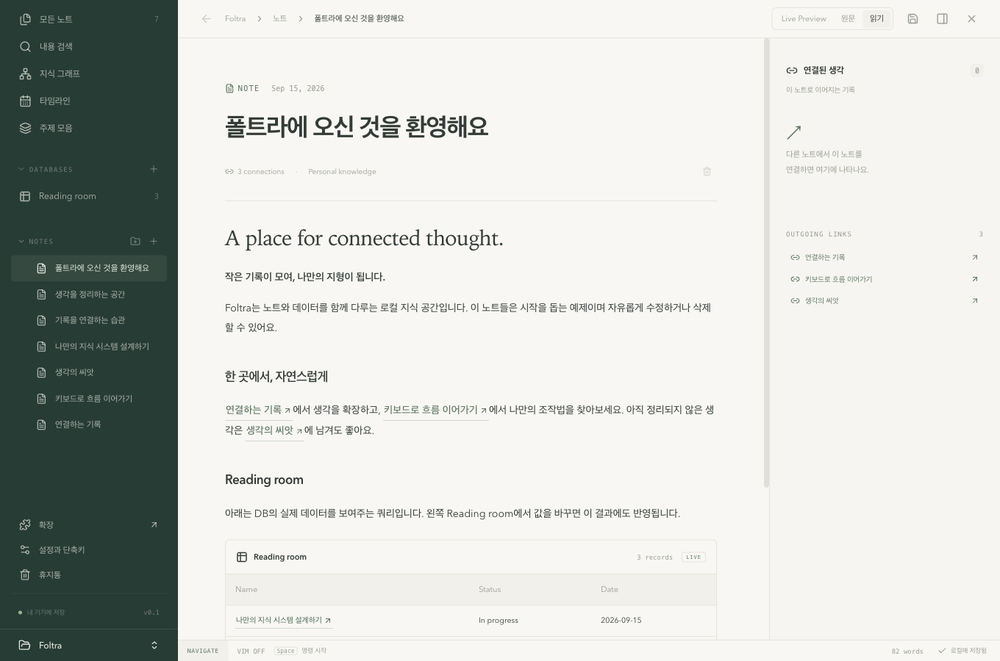

# Foltra · 폴트라

**내 컴퓨터에 기록하고, 생각을 연결하는 노트 앱.**

메모를 쓰고, 관련 노트를 연결하고, 표로 자료를 정리하세요. 계정 없이 시작하며 인터넷이 없어도 기록을 읽고 편집할 수 있습니다. Vim과 플러그인은 필요할 때 켜면 됩니다.

[**macOS 다운로드**](https://github.com/snacky101/foltra/releases/tag/v0.1.0-preview.9) · [이번 버전의 변화](docs/releases/v0.1.0-preview.9.md) · [CLI 안내](docs/CLI.md) · [개발 안내](docs/DEVELOPMENT.md)



> [!NOTE]
> 현재는 **Apple Silicon Mac용 개발 프리뷰**입니다. 기능별 구현·검증 범위는 [개발 현황](docs/STATUS.md)에 기록합니다. Intel Mac·Windows·Linux·모바일용 설치 파일은 아직 제공하지 않습니다.

## 설치하고 첫 노트 쓰기

1. [**DMG 다운로드**](https://github.com/snacky101/foltra/releases/download/v0.1.0-preview.9/Foltra_0.1.0-preview.9_aarch64.dmg)를 열고 **Foltra.app → Applications**로 옮깁니다.
2. 응용 프로그램에서 Foltra를 실행하고 **새 vault**를 만듭니다. Vault는 노트와 데이터를 담아두는 **내 컴퓨터의 폴더**입니다.
3. **새 노트**를 눌러 적으세요. 편집 내용은 자동으로 저장됩니다. 둘러보고 싶다면 시작 화면에서 **예제 노트와 DB를 담아 시작하기**를 선택하세요.

앱을 사용하는 데 Node.js나 Rust를 설치할 필요는 없습니다. 이미 사용 중이라면 **설정 → 앱 업데이트**에서 새 버전을 받을 수 있습니다. 업데이트 기능이 없는 `preview.1`은 DMG로 한 번 수동 설치해야 합니다.

<details>
<summary><strong>처음 실행할 때 macOS가 차단한다면</strong></summary>

현재 배포본에는 Apple Developer ID 서명·공증이 없습니다. 다운로드 출처를 확인한 뒤 실행하기로 했다면 **시스템 설정 → 개인정보 보호 및 보안 → 확인 없이 열기**를 사용하세요. macOS 버전에 따른 절차는 [Apple 안내](https://support.apple.com/guide/mac-help/mh40616/mac)를 참고하세요.

</details>

## 세 가지만 알면 시작할 수 있어요

| 이름             | 쉽게 말하면                                | 이렇게 씁니다                                               |
| ---------------- | ------------------------------------------ | ----------------------------------------------------------- |
| **Vault**        | 여러 공책을 담는 가방                      | 개인 기록과 업무 기록을 서로 다른 vault에 보관              |
| **노트와 링크**  | 공책의 한 페이지와 다른 페이지로 가는 표시 | `[[여행 계획]]`을 적어 관련 노트에 연결                     |
| **데이터베이스** | 필요한 칸을 직접 만드는 표                 | 읽을 책의 제목·상태·날짜를 정리하고 필요하면 행에 본문 연결 |

노트 본문과 데이터는 선택한 vault 안에 저장합니다. 이미지를 붙여넣으면 첨부파일도 vault에 저장합니다. Vim·글꼴·테마 등 앱 설정과 설치한 확장은 vault별로 관리합니다.

## 흩어진 메모를 한 주제로 모으기

월요일과 수요일 노트에 아래처럼 적었다고 해보세요.

```markdown
- 인터뷰 질문 정리 [[프로젝트]]
  - 가장 불편한 순간을 물어보기
```

```markdown
- 첫 시제품을 보여주고 의견 받기 [[프로젝트]]
```

**주제 모음 → 프로젝트**를 열면 두 노트의 해당 블록이 카드로 모입니다. 첫 카드에는 하위 항목도 함께 나옵니다. 원본은 각 노트에 그대로 있고, 카드를 끌어 원하는 순서로 읽을 수 있습니다.

이 연결은 다른 화면에서도 활용합니다.

| 보고 싶은 것                 | 열어볼 곳                                 |
| ---------------------------- | ----------------------------------------- |
| 이 노트를 언급한 다른 노트   | 오른쪽 사이드바의 **연결된 생각**(백링크) |
| 노트들이 서로 연결된 모습    | **지식 그래프**                           |
| 기록을 만들거나 수정한 흐름  | **타임라인**                              |
| 같은 주제를 다룬 문단과 목록 | **주제 모음**                             |

자세한 규칙은 [링크](docs/LINKS.md)와 [주제 모음](docs/TOPICS.md) 안내에 있습니다. `[[노트 이름|화면에 보일 이름]]`처럼 표시 이름을 따로 지정할 수도 있습니다.

## 필요한 방식으로 쓰세요

| 하고 싶은 일             | Foltra에서 할 수 있는 것                                                  | 안내                                                 |
| ------------------------ | ------------------------------------------------------------------------- | ---------------------------------------------------- |
| 편하게 메모하기          | Live Preview·원문·읽기 모드, 자동 저장, 이미지 붙여넣기, 표·코드 블록     | [편집](docs/EDITING.md)                              |
| 할 일과 속성 정리하기    | `- [ ]` 체크리스트, 상태 아이콘, 태그·자동완성, YAML 속성                 | [할 일](docs/TASKS.md) · [속성](docs/FRONTMATTER.md) |
| 표로 자료 관리하기       | 노트 없이도 행 추가, 컬럼 이름·타입·너비·순서 변경, 표·보드·날짜 타임라인 | [데이터 구조](docs/ARCHITECTURE.md)                  |
| 노트 안에 조회 결과 넣기 | DB와 컬럼 이름으로 SQL을 작성해 필터·정렬·집계·조인                       | [SQL](docs/SQL.md)                                   |
| 키보드로 작업하기        | 선택형 Vim, text object, Leader 조합, 일반 단축키·키 기록                 | [편집과 Vim](docs/EDITING.md)                        |
| 필요한 도구만 더하기     | Anki, 일지 캘린더, 날짜 자동완성, Git 동기화, 사용자 확장 파일            | [확장 SDK](docs/PLUGIN_SDK.md)                       |
| 색과 글꼴 바꾸기         | 편집기·DB 글꼴 설정, 기본 테마, 추가 테마 설치·삭제                       | [테마](docs/THEMES.md)                               |
| 실수한 기록 되찾기       | 노트·폴더·DB 휴지통과 복원, 백업 내보내기·복원                            | [CLI의 관리 명령](docs/CLI.md)                       |

데이터베이스의 **행은 노트 없이도 존재**합니다. 예를 들어 책 목록에 제목만 먼저 넣고, 나중에 그 행에 독서 메모를 연결할 수 있습니다. 노트 안 SQL은 로컬 데이터를 조회하며 외부 PostgreSQL 서버에 접속하는 기능은 아닙니다.

## 키보드로 쓰고 싶다면

**Vim은 기본으로 꺼져 있습니다.** 설정에서 켜세요. Leader는 여러 키를 차례로 눌러 명령을 실행하는 시작 키이며, 기본값은 `Space`입니다.

| 동작           | macOS 기본 키 | Leader 조합     |
| -------------- | ------------- | --------------- |
| 명령 찾기      | `Cmd+k`       | —               |
| 새 노트        | `Cmd+n`       | `Space → n → n` |
| 저장           | `Cmd+s`       | `Space → n → s` |
| 읽기·편집 전환 | `Cmd+e`       | `Space → n → p` |
| 주제 모음      | —             | `Space → v → c` |
| 설정 열기      | `Cmd+,`       | `Space → s → s` |

설정에서는 조합을 `<leader>nn`처럼 적거나 직접 키를 눌러 기록할 수 있습니다. 확장 명령에도 같은 방식으로 단축키를 붙입니다. Leader를 누른 뒤에는 다음 키를 기다리며, 취소하려면 `Esc`를 누르세요. 본문 입력 중에는 Leader가 글쓰기를 가로채지 않습니다.

<details>
<summary><strong>Vim을 켰을 때 자주 쓰는 키</strong></summary>

- `:w` 저장, `:q` 현재 노트 닫기, `:wq` 저장 후 닫기.
- `gd`는 이미 있는 링크 대상으로 이동합니다. `Cmd+Enter`는 없는 노트 링크라면 생성해서 엽니다.
- `Ctrl+o` / `Ctrl+i`로 링크 탐색의 이전 / 다음 위치를 엽니다.
- `Ctrl+h/j/k/l`로 화면 영역을 옮기고, 사이드바에서 `j/k`로 항목을 고릅니다.
- 굵게·기울임·링크·괄호 등의 범위를 편집하는 text object는 [편집 안내](docs/EDITING.md)에서 확인하세요.

`:q!`는 아직 저장하지 않은 초안만 버립니다. 이미 자동 저장된 내용을 되돌리는 명령은 아닙니다. 단축키의 대소문자는 구분합니다.

</details>

## 확장과 테마

**설정 → 확장 → 플러그인 사용**을 처음 켤 때 한 번 동의하세요. 그다음부터는 원하는 확장을 **설치 → 활성화**하면 됩니다. 동의는 현재 기기의 vault별로 기억하며, 다시 켜거나 앱에서 확장을 업데이트해도 반복하지 않습니다.

| 확장                            | 하는 일                                                                                    |
| ------------------------------- | ------------------------------------------------------------------------------------------ |
| [Anki 연결](docs/ANKI.md)       | 태그가 붙은 블록이나 DB 행을 AnkiConnect로 카드에 동기화. 연결된 노트 본문과 이미지도 사용 |
| [일지 캘린더](docs/CALENDAR.md) | 오른쪽 달력에 날짜 노트를 표시하고 오늘 노트를 열거나 생성                                 |
| 날짜 자동완성                   | `@Today`, `@Yesterday`, `@Tomorrow` 후보를 고르면 실제 날짜 텍스트로 바꾸기                |
| [Git 동기화](docs/GIT.md)       | 사용자가 연결한 Git 저장소에 기록을 보내고 다른 기기의 변경 가져오기                       |

전체 플러그인 사용을 꺼도 개별 활성화 선택은 기억합니다. 확장이 사용하는 권한은 각 항목에서 펼쳐볼 수 있습니다. **파일로 설치**도 지원하며, 모든 Obsidian 플러그인을 그대로 설치하는 호환 기능은 아닙니다.

테마는 **설정 → 테마**에서 관리합니다. 기본 **Paper & Pine / Midnight**, 설치형 **Catppuccin Mocha / Rosé Pine / Tokyo Night / Darcula**를 제공합니다. 테마에는 플러그인 사용 동의가 필요하지 않습니다.

## 터미널이나 에이전트에서 사용하기

CLI는 터미널에서 짧은 명령으로 Foltra를 다루는 도구입니다. 앱에 포함되어 있으며 **설정 → CLI → CLI 설치**를 한 번 누르면 `foltra` 명령을 사용할 수 있습니다.

```sh
# 앱에서 이 vault 열기
foltra ~/Foltra/Personal

# 아래 데이터 명령이 사용할 기존 vault 지정
export FOLTRA_VAULT="$HOME/Foltra/Personal"

# 앱을 켜지 않고 오늘 일지에 한 줄 추가
foltra daily append --content '- 오늘 떠오른 생각'

# 프로젝트 메모를 만들고 제목으로 읽기
foltra create --title '프로젝트 메모' --content '# 프로젝트'
foltra read --note '프로젝트 메모'
foltra tasks --status todo

# 사용할 수 있는 명령 확인
foltra help all
```

에이전트는 `foltra commands list --json`으로 명령과 인자 형식을 확인할 수 있습니다. JSON·JSONL·CSV·TSV 출력, 검색·속성·DB·SQL·백업 명령은 [CLI 안내](docs/CLI.md)에 정리했습니다. CLI와 앱은 같은 저장 규칙을 사용합니다.

## 더 알아보기

- **직접 실행·개발하기:** [개발 환경과 Make 명령](docs/DEVELOPMENT.md)
- **확장 만들기:** [SDK 시작하기](packages/plugin-sdk/README.md) · [실행 계약과 제한](docs/PLUGIN_SDK.md)
- **프로젝트 이해하기:** [구조](docs/ARCHITECTURE.md) · [구현·검증 현황](docs/STATUS.md) · [장기 설계](docs/DESIGN.md)
- **배포하기:** [업데이트와 릴리스](docs/UPDATES.md)

모바일, 관계·수식 DB, 대규모 vault 성능 보장은 아직 준비 중입니다. Git 동기화는 선택 기능이며 Foltra 계정이나 전용 클라우드에 가입하지 않고 로컬로만 사용할 수 있습니다.
