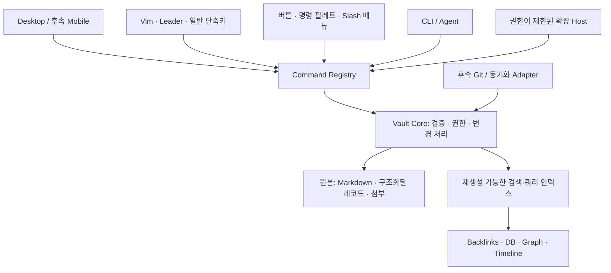

**Foltra(폴트라) — 제품·구조 설계 초안 v0.1**

작성일: 2026-09-14. 상태: 앱 이름 Foltra(폴트라) 확정. 제품·구조는 검토용 제안이며 구현·성능 검증 전.

2026-09-15: 이 문서는 전체 제품 설계를 보존한다. 0.1 프리뷰의 실제 구현·제약은 [ARCHITECTURE.md](ARCHITECTURE.md), 요구사항별 진행 상태는 [STATUS.md](STATUS.md)를 기준으로 확인한다.

이 문서는 snack-note와 별개인 새 프로젝트를 다룬다. 아래의 저장 형식, 명령 이름, 수치, 기술 선택은 제안이며 구현된 사양이 아니다. 사용자 요청은 요구사항으로 고정하고, 답변이 필요한 선택은 따로 표시한다.

**1. 앱 이름: Foltra(폴트라)**

| 후보 | 읽기 | 의도한 이미지 | 판단 |
|---|---|---|---|
| Foltra | 폴트라 | Folio와 trail에서 착안. 기록과 그 기록을 따라가는 경로 | 사용자 선택으로 확정. 동명 비소프트웨어 조직이 검색되어 공개 사용 전 추가 확인 필요 |
| Nodune | 노듄 | Node와 dune에서 착안. 연결된 지식이 쌓여 하나의 지형을 이룸 | 초기 후보. 노트·DB·그래프를 포괄하는 이미지 |
| Knavo | 나보 | Knowledge와 navigation에서 착안한 조어 | 키보드 탐색 이미지가 좋지만 철자와 발음이 덜 직관적 |

어원은 작명 의도이며 사전상의 뜻이 아니다. 정확한 이름과 app/software/notes를 조합한 초기 웹 검색에서 이 세 후보의 뚜렷한 동명 노트 앱을 찾지 못했다. 검색 범위가 제한적이므로 사용 가능성이나 권리 확보를 뜻하지 않는다. 도메인, GitHub 조직, npm/crates 패키지, 앱스토어, 상표 검토는 이름을 좁힌 뒤 별도로 확인해야 한다.

앱 이름은 Foltra(폴트라)로 확정한다. CLI 예시는 `foltra`를 사용한다. 공개 저장소·패키지 등 식별자의 가용성은 별도로 확인한다. 제품 설명 제안: “기록하고, 연결하고, 키보드로 다루는 나만의 지식 공간.”

**2. 제품의 중심과 임시 전제**

목표: 사용자가 소유하는 vault 안에서 노트와 구조화된 데이터를 함께 관리하고, 모든 앱 기능을 명령으로 호출하며, 개인의 작업 방식에 맞게 확장하는 도구.

우선 사용자 가설은 Vim과 agent를 사용하는 개인 지식 작업자다. 이는 이번 요청에 따른 설계 기준이며 시장 수요가 검증되었다는 뜻은 아니다.

- 확정 요구: local-first, vault, 선택형 Vim, leader와 일반 단축키, 플러그인, 테마, 백링크, 독립형 DB, 노트 내 쿼리, 다양한 뷰, CLI, 후속 동기화·cross-platform 대응.
- 임시 전제: Markdown 중심 편집에 블록 참조와 DB 삽입을 결합한다. Notion식 블록 편집이 우선이면 편집기와 원본 형식을 다시 평가한다.
- 임시 전제: 데스크톱부터 출시한다. macOS/Windows/Linux 지원 순서와 첫 출시의 지원 OS는 아직 미정이다. 모바일은 후속이다.
- “/ 커맨드 옵션”은 slash 메뉴를 켜고 끌 수 있다는 뜻으로 해석한다. Vim 설정과 독립적으로 제어한다.
- 실시간 다중 사용자 공동 편집은 요청에 포함된 것으로 가정하지 않는다. 여러 기기 간 비동기 동기화는 범위에 포함한다.
- Obsidian과 비슷한 설치 경험을 목표로 하되, 기존 Obsidian 플러그인·테마의 무수정 호환은 별도 요구로 간주한다.

**3. 요구사항과 완료 판정**

| ID | 요구 | 설계 원칙 | 완료를 판정할 사용자 동작 |
|---|---|---|---|
| R01 | 독립 프로젝트 | 독립 저장소·설정·앱 식별자 | snack-note 데이터 없이 설치·실행 가능 |
| R02 | Vault와 오프라인 | vault가 데이터 경계, 계정 불필요 | 인터넷 없이 생성·열기·편집·검색·백업·복구 |
| R03 | 선택형 Vim | 편집기 모드와 앱 탐색을 구분 | Vim on/off, normal/insert/visual, 한글 입력과 전환 |
| R04 | Leader + 일반 단축키 | 공통 Command Registry | 같은 명령에 leader sequence와 일반 조합을 동시에 배정 |
| R05 | 기능 플러그인 | 명령·뷰·설정·권한 등록 계약 | 설치한 플러그인의 기능이 명령 목록과 키맵 편집기에 등장 |
| R06 | 테마 확장 | 설치 가능한 버전 있는 테마 패키지 | 미리보기·설치·전환·제거·기본 테마 복구 |
| R07 | 백링크와 추적 | 노트·블록·레코드 ID 및 문맥 | 인용한 위치로 이동하고 이름 변경 후에도 참조 유지 |
| R08 | 독립 DB | DB 행과 노트 본문을 분리 | 노트 파일 생성 없이 DB와 여러 행을 생성·입력 |
| R09 | DB 안의 노트 | 행에 선택적 본문 연결 | 행에서 본문 작성·열기, 기존 노트 연결 |
| R10 | 노트 내 쿼리 | 공통 쿼리 엔진, 저장된 뷰 참조 | 원본 DB 수정이 삽입된 결과에 반영 |
| R11 | DB 뷰 | 표·보드·리스트·갤러리·캘린더·타임라인 | 같은 데이터로 뷰 전환, 필터·정렬·그룹화 유지 |
| R12 | 지식 뷰 | 그래프·타임라인 및 View API | 선택한 노트의 이웃과 관련 날짜를 서로 다른 뷰로 탐색 |
| R13 | CLI/agent | GUI와 같은 데이터 처리 규칙 | GUI 종료 상태에서 읽기·검색·DB 변경·백링크 조회 |
| R14 | Slash 메뉴 옵션 | Vim과 독립된 사용자 설정 | 꺼진 상태에서 `/`는 문자 입력, normal 모드에서는 Vim 검색 |
| R15 | Git와 후속 동기화 | 동기화 가능한 원본·안정된 ID | 두 기기의 독립 편집을 합치고 충돌을 보존하여 해결 |
| R16 | 성능·안정성·보안 | 측정 가능한 출시 기준 | 아래 13절의 성능·복구·권한 테스트 통과 |

핵심 통합 시나리오: vault 생성 → 본문 없는 Tasks DB 행 생성 → leader로 행의 본문 열기·작성 → 다른 노트의 특정 블록을 인용 → 백링크에서 원문 이동 → 노트에 Tasks 쿼리 삽입 → CLI가 행 상태 변경 → DB/삽입 뷰 갱신 → 확장 타임라인 설치 → 같은 기능에 leader와 일반 단축키 배정 → 재시작 후 데이터와 설정 유지.

**4. 전체 구조**



Command Registry는 명령의 목록과 계약을 제공하고, Vault Core는 실제 데이터 변경의 일관성을 책임진다. 버튼·CLI·플러그인이 각각 파일을 수정하는 별도 구현을 만들지 않는다. 편집기의 문자 입력까지 매번 IPC로 왕복시키지는 않는다. 로컬 편집 transaction을 묶어 Core에 저장한다.

UI에서 읽기 쉬운 화면 동작과 데이터 명령을 구별한다. 예를 들어 `view.graph.open`은 GUI가 필요하지만 `links.list`는 headless로 실행 가능하다. GUI 전용 명령을 CLI에서 호출하면 구조화된 `requires_ui` 오류를 반환한다.

**5. 공통 명령과 키보드 모델**

명령의 필수 정보: 안정된 namespaced ID, 표시 이름, 인자 schema, 사용 가능한 문맥, 필요한 권한, UI 필요 여부, undo/취소 가능 여부. UI에서 인자가 생략되면 입력창을 열 수 있지만, CLI에서는 인자를 명시하거나 오류를 받는다.

아래는 동작을 설명하는 예시 키맵이며 확정 기본값은 아니다. `<leader>`는 기본 Space를 제안한다. `Mod`는 macOS의 Cmd, Windows/Linux의 Ctrl로 해석한다.

| 기능 | 명령 예시 | Leader 예시 | 일반 단축키 예시 |
|---|---|---|---|
| 노트 생성 | `note.create` | `<leader> n n` | `Mod+n` |
| 노트 찾기 | `note.find` | `<leader> f f` | `Mod+p` |
| 백링크 열기 | `backlinks.open` | `<leader> l b` | 사용자 지정 |
| 그래프 열기 | `view.graph.open` | `<leader> v g` | 사용자 지정 |
| 현재 DB에 행 생성 | `database.record.create` | `<leader> d n` | 사용자 지정 |
| 확장 타임라인 열기 | `plugin.example.timeline.open` | `<leader> v t` | 사용자 지정 |

- 키맵 화면에서 명령 검색, 키 녹화, 중복 확인, 현재 적용 문맥과 재정의 출처를 제공한다.
- Leader를 누르면 다음에 가능한 키를 보여주는 안내를 제공한다. Leader와 중간 조합은 시간 제한 없이 기다리며 Esc·명령 완료·일치하지 않는 입력·창 포커스 이탈로 종료한다. 접두사 중복은 설정 시 차단하고 대소문자를 구분한다.
- 입력 중 Space를 가로채지 않는다. Leader 기본 활성 범위는 Vim normal 모드와 텍스트 입력 밖의 탐색 문맥이다. Vim을 꺼도 일반 단축키와 텍스트 입력 밖의 leader 사용은 가능하게 한다.
- 설정 우선순위: 같은 문맥에서 사용자 설정 > vault 설정 > 확장 기본값 > 앱 기본값. 설치된 확장이 기존 사용자 키맵을 조용히 덮어쓰지 않는다.
- 라우팅은 대화상자·한글 조합 상태·입력/탐색 문맥을 먼저 판별한다. 조합 중인 문자와 운영체제 예약 키는 임의로 앱 명령으로 바꾸지 않는다.
- 에디터, 표의 셀 편집, 표의 행 선택, 사이드바, 그래프는 서로 다른 문맥이다. `j`가 문자 입력인지 이동인지를 현재 문맥으로 결정하고 화면에 표시한다.
- 화면 포커스와 명령 문맥은 분리하지 않는다. 플러그인 iframe 안에서도 호스트와 정해진 메시지 규약으로 문맥을 동기화한다.
- 앱과 확장이 제공하는 사용자 동작은 명령으로 등록하도록 SDK 계약과 검증기를 만든다. 임의의 제3자 코드가 계약을 지킬 것이라고 가정하지 않는다.
- Vim 지원 범위는 motions/operators, counts, text objects, visual, search, registers, repeat, undo/redo, macros, remap, ex commands 각각을 호환성 표로 관리한다. “Vim 모드”를 Neovim 실행 환경 전체와 동일하다고 표현하지 않는다.
- 필수 입력 검증은 한글 IME, 한/영 전환, 조합 중 Esc, emoji, 여러 줄 붙여넣기, macOS/Windows/Linux 키보드 배열을 포함한다.

Slash 메뉴는 insert/일반 입력 모드의 설정된 위치에서만 열린다. 비활성화하면 자동 메뉴를 띄우지 않는다. Vim normal 모드의 `/` 검색과 명령 팔레트는 별도로 유지한다.

**6. 데이터 모델: 노트와 DB 행을 별도 객체로**

| 객체 | 역할 | 중요한 규칙 |
|---|---|---|
| Vault | 하나의 데이터 공간 | 고유 ID, 형식 버전, 로컬 위치와 설정 |
| Note | 본문 문서 | 고유 ID와 제목/경로 분리 |
| Block | 문서 안의 참조 가능한 단위 | 영구 참조 시 ID 저장, 이동 후에도 ID 유지 |
| Database | 레코드의 스키마와 집합 | 노트가 하나도 없어도 생성 가능 |
| Property | 이름과 타입을 가진 필드 | 이름 변경에도 유지되는 ID |
| Record | DB의 한 행 | 필드 값과 선택적 `bodyNoteId` |
| Link | 방향과 종류가 있는 관계 | source/target ID, 문맥과 출처 |
| View | 데이터의 표시 설정 | 데이터 소스, 쿼리, 레이아웃, 필터, 정렬, 그룹 |
| Attachment | 첨부 파일 | 고유 ID, 메타데이터, 참조 추적 |

첫 모델은 Record 하나에 대표 본문 Note 0..1개를 허용한다. 하나의 Note를 여러 Record에서 대표 본문으로 참조하는 것은 허용하되, Note의 수명은 독립적으로 관리한다. 추가 노트나 여러 대상 연결에는 relation/link 속성을 사용한다.

예: Tasks DB에 제목·상태·마감일만 입력하면 Record만 생긴다. 행을 열어 본문을 실제로 저장할 때 Note를 만들고 연결한다. 기존 Note를 붙일 수도 있다. 비어 있는 본문 미리보기를 열었다 닫는 것만으로 파일을 만들지 않는다.

행 삭제는 연결된 노트를 자동으로 삭제하지 않는다. 노트 삭제 시에도 행의 속성은 유지하고 삭제된 본문 연결 상태를 표시한다. 다른 곳에서 참조되는 데이터의 수명을 한 화면의 삭제 동작에 종속시키지 않는다. 휴지통과 복구 동작도 이 규칙을 따른다.

DB 속성은 text, number, boolean, date/date-range, select/multi-select, status, URL, attachment, relation을 기본 범위로 잡는다. formula와 rollup도 제품 범위에 포함하고, 순환 참조·잘못된 타입·날짜 시간대의 의미를 사양으로 정한다. 필드 타입 변경은 변환 미리보기와 복구 경로를 제공한다.

백링크는 note→note뿐 아니라 block→block, note→record, record→note, relation을 다룬다. 실제 링크와 텍스트상의 미연결 언급은 구분한다. 원문 문맥·문서별 그룹·필터·참조/임베드·참조 위치로 이동을 제공한다. 링크가 끊겼거나 중복 제목으로 모호하면 이를 표시한다.

2026-09-15 결정: 내부 노트 ID와 UUID 파일명은 유지하되, Markdown 원문은 `[[제목]]`을 기본으로 하고 `[[제목|표시 이름]]`을 지원한다. core를 통한 제목 변경은 참조를 함께 갱신한다. 중복·문법 충돌 제목과 삭제된 대상은 UUID로 구분한다. 기존 UUID 링크도 호환하며 세부 계약은 [LINKS.md](LINKS.md)를 따른다. 외부 편집기가 바꾼 제목 문자열만 보고 대상을 완벽히 복구할 수 있다고 약속하지 않는다.

이 선택은 비교 대상의 내부 구조를 그대로 따르는 것은 아니다. Obsidian Bases는 Markdown 파일과 속성을 데이터로 쓰며, Notion은 DB의 항목 자체를 페이지로 설명한다. 여기서는 “DB부터 만들고 필요하면 본문을 붙인다”는 요청에 맞춰 Record와 Note를 분리한다. [Obsidian Bases 공식 문서](https://obsidian.md/help/bases), [Notion 데이터베이스 공식 문서](https://www.notion.com/help/intro-to-databases).

**7. 저장 방식: 원본과 인덱스를 구분**

잠정 추천은 Markdown 노트 + 구조화된 텍스트 레코드를 원본으로 두고, SQLite를 검색·링크·쿼리용 재생성 가능한 인덱스로 사용하는 방식이다.

| 선택 | 이점 | 대가 | 현재 판단 |
|---|---|---|---|
| 텍스트 원본 + 파생 SQLite | 외부 편집·Git diff·앱 없는 데이터 접근 | 여러 파일 변경의 복구와 많은 파일 처리 설계 필요 | 우선 검증 후보 |
| SQLite 원본 + 내보내기/변경 동기화 | transaction과 큰 DB 관리가 단순해짐 | Markdown 양방향 편집과 Git 사용 경험이 복잡해짐 | 첫 후보가 검증에 실패할 경우 재평가 |

두 저장소를 동시에 원본으로 취급하지 않는다. 제안 디렉터리는 다음과 같다. 실제 확장자와 스키마는 아직 확정하지 않는다.

```text
vault/
  notes/                         # Markdown 원본, ID 포함
  databases/<database-id>/
    schema.json                  # 스키마 원본
    records/<record-id>.json      # 독립 레코드 원본
  views/<view-id>.json            # 뷰와 저장 쿼리 원본
  assets/                        # 첨부 원본
  .app/
    vault.json                   # vault ID, 형식 버전
    settings.json                # 공유할 vault 설정
    extensions.lock.json         # 확장 버전 정보, 실행 신뢰와 분리
    local/                       # journal, history, lock 등 기기 전용 상태
    cache/                       # 지워도 재생성할 수 있는 index.sqlite
```

`local/`은 cache와 다르다. 미완료 transaction 복구 기록과 아직 보존이 필요한 로컬 이력은 재생성할 수 없으므로 캐시 청소로 지우면 안 된다. 전체 재해 복구 백업에는 원본과 필요한 복구·이력 정보를 포함한다. Git에는 완료된 원본과 선택한 공유 설정만 넣는다. 비밀 키·기기 경로·잠금·캐시·미완료 journal은 넣지 않는다.

저장 처리의 검증할 계약:

1. 앱과 CLI의 변경은 vault별 단일 writer로 직렬화한다. 서로 다른 프로세스가 파일을 경쟁적으로 덮어쓰지 않는다.
2. 변경 대상 revision을 확인하고, 복구에 필요한 변경 묶음을 영속 journal에 기록한다.
3. 임시 파일과 원자적 교체를 사용하고, 여러 파일의 중간 상태는 Core의 reader에게 노출하지 않는다. 완료를 확인한 후에만 저장 성공을 응답한다.
4. 중단된 transaction은 재시작 시 재적용 또는 복원하여 완결한다. 파일 하나의 atomic rename이 여러 파일 전체의 atomic commit을 보장하지는 않는다.
5. 인덱스 갱신은 원본의 revision을 기록한다. 저장 직후 쿼리는 최소 요청 revision까지 반영된 결과를 읽거나 갱신 중임을 알려 오래된 결과를 최신처럼 표시하지 않는다.

독립적인 외부 편집기나 Git 명령은 앱의 writer lock을 따르지 않을 수 있다. 앱이 열어 둔 buffer와 외부 변경을 비교하고, 충돌한 원본을 덮어쓰지 않는다. 외부 파일 관찰자가 다중 파일 transaction의 중간 상태를 볼 수 있다는 한계도 있다. 앱의 Git adapter는 완료된 checkpoint에서만 snapshot을 만든다.

큰 DB의 파일 수, 기동 시 파일 검사 비용, 백신/파일 감시 영향, journal 복구의 복잡도를 먼저 검증한다. 이 검증이 실패하면 SQLite 원본 안을 다시 비교한다. 완전한 범용 데이터베이스 엔진을 새로 구현하는 방향으로 진행하지 않는다.

SQLite WAL은 같은 호스트에서 읽기/쓰기 동시성을 지원하지만 네트워크 파일시스템에서의 공유를 지원하지 않는다. 따라서 실행 중인 SQLite 파일을 기기 간 동기화 원본으로 삼지 않는다는 설계 판단이다. [SQLite WAL 공식 문서](https://sqlite.org/wal.html).

**8. 쿼리와 뷰**

모든 뷰는 공통 Query API가 반환한 데이터에 레이아웃을 적용한다. 그래프·타임라인·표가 각자 별도의 데이터 저장소나 필터 엔진을 만들지 않는다.

- 노트에 저장된 뷰를 삽입하는 방법과, 노트 안에서 직접 쿼리를 정의하는 방법을 제공한다.
- 필터·정렬·그룹·페이지 나누기·relation 조회·집계·formula를 단계적으로 지원한다. 단순 문자열 검색만으로 쿼리 요구를 충족했다고 보지 않는다.
- 시각적 필터 편집기와 텍스트 쿼리는 같은 내부 표현으로 연결한다. 실제 언어와 문법은 RFC에서 결정한다.
- 사용자 입력을 임의 JavaScript나 무제한 SQL로 실행하지 않는다. 읽기 전용 검증, 허용 함수, 자원 제한, 취소, 결과 크기 제한을 둔다.
- 편집 가능한 DB 뷰에서는 셀 변경을 명령으로 처리한다. 집계·join 결과는 명확한 대상 Record/Property 매핑이 없는 한 읽기 전용이다.
- 노트 쿼리는 현재 노트·현재 날짜 등의 매개변수를 사용할 수 있다. 날짜 기반 결과의 갱신 시점과 시간대는 명시한다.
- 삽입된 쿼리의 실제 결과와 명시적으로 작성한 참조를 구분하여, 결과가 바뀔 때 의도치 않게 영구 백링크가 생기지 않게 한다.
- 실시간 반영은 변경된 데이터에 의존하는 쿼리만 다시 계산한다. 많은 삽입 뷰가 편집을 막지 않게 작업을 분리한다.

그래프: 전체/현재 노트 주변 그래프, 관계 종류 필터, 이웃 확장, 노트·레코드 구분, 선택 대상 열기, 텍스트 목록 대체 탐색. 큰 그래프는 범위·깊이 제한과 점진적 렌더링을 제공한다.

타임라인: 생성 시각·수정 시각·DB 날짜/기간 중 기준을 선택하고, 날짜 없는 항목을 숨김 또는 별도 그룹으로 다룬다. 날짜 기반 정렬 뷰와 과거 시점의 전체 지식을 재구성하는 기능은 다르다. 후자는 전체 변경 이력에 대한 별도 사양이 필요하며 현재 타임라인의 기본 요구로 묶지 않는다.

확장 View API에는 지원 데이터 소스, 설정 schema, 명령, 선택/포커스, 생성/해제 lifecycle, 오류 대체 화면, 데이터 취소·페이지 나누기 계약이 필요하다. 확장을 끄더라도 저장된 뷰 정의와 원본 데이터는 보존한다.

**9. 플러그인과 테마**

설치·버전 관리·설정·명령 등록은 초기에 정한다. 최소한 하나의 샘플 플러그인으로 명령 → 키맵 → 데이터 읽기/변경 → 뷰 열기까지 검증한 뒤 SDK를 공개한다.

플러그인 manifest에는 ID, 버전, SDK 범위, 지원 플랫폼, 명령, 뷰, 설정 schema, 요청 권한을 둔다. 권한은 vault 읽기/쓰기, 허용된 네트워크 대상, 사용자가 고른 외부 파일 접근 등을 나눈다. 설치 자체가 모든 권한 부여를 뜻하지 않게 한다.

- 커뮤니티 확장은 앱 core나 편집기 DOM에 직접 접근하는 코드로 실행하지 않는 방식을 기본으로 제안한다.
- 실행 로직에는 호스트 파일시스템/네트워크를 직접 노출하지 않는 격리 runtime과 허용된 RPC만 제공한다. UI는 제한된 별도 문맥에서 그린다.
- 단순 Web Worker나 별도 Node 프로세스만으로 권한 격리가 되었다고 판단하지 않는다. 실제 OS/runtime 경계를 검증해야 한다.
- CPU·메모리·메시지 크기·실행 시간 한도를 두고 멈춘 확장을 종료할 수 있게 한다. 분리 실행도 자원 고갈을 저절로 해결하지는 않는다.
- 패키지 무결성, 업데이트 출처, 권한 증가 시 재동의, 이전 버전 복원, 안전 모드, 활성 확장별 오류 진단을 제공한다. 서명은 게시자와 무결성을 확인하는 수단이며 안전한 코드라는 보증은 아니다.
- 다른 기기에서 동기화된 extension lock은 목록일 뿐이다. 받은 vault가 임의 코드를 자동으로 실행하거나 기기 권한을 획득하게 하지 않는다.
- native 확장이나 에디터 내부 객체에 직접 접근하는 고신뢰 확장은 별도 보안·호환성 검토 대상으로 남긴다. 모든 종류의 플러그인을 동일한 격리 모델로 제공할 수 있다고 약속하지 않는다.

테마는 버전 있는 패키지로 설치한다. 색상·폰트·간격·문법 강조 등 공개 토큰과 제한된 스타일 범위를 제공한다. 외부 URL, 원격 폰트, 무제한 CSS는 개인정보 유출과 UI 위장 가능성까지 고려하여 검증한다. 권한 창·보안 상태·복구 화면은 커뮤니티 테마가 가리거나 바꾸지 못하게 한다. 완전 자유 CSS 호환은 이 기본 정책과 충돌하므로 별도 선택이다.

제안하는 격리에는 기능의 대가가 있다. 앱 내부를 임의로 고치는 확장은 제한된다. 사용자 요청의 보안·안정성을 우선한 제안이며, 이 자유도를 얼마나 허용할지는 SDK 동결 전에 결정해야 한다.

Obsidian의 공식 설명상 커뮤니티 플러그인에 세부 권한을 신뢰성 있게 제한하기는 어렵고 앱의 접근 권한을 물려받는다. 이 프로젝트는 설치 경험을 참고하면서 별도의 권한 모델을 설계한다는 제안이다. [Obsidian 플러그인 보안 문서](https://obsidian.md/help/plugin-security).

Tauri를 선택하더라도 이 설계를 자동으로 얻는 것은 아니다. Tauri 공식 문서는 core/native plugin 코드가 시스템 자원에 접근할 수 있고, WebView와 core 사이의 IPC 경계를 따로 보호해야 한다고 설명한다. 앱의 커뮤니티 플러그인과 Tauri의 native plugin은 서로 다른 개념으로 다뤄야 한다. [Tauri 보안 문서](https://v2.tauri.app/security/).

**10. CLI와 agent**

CLI는 GUI 없이 vault core를 실행할 수 있어야 한다. GUI가 같은 vault를 열고 있으면 로컬 IPC로 이미 실행 중인 writer에 연결하고, 없으면 작업 동안 core를 실행하는 방식을 검증한다. 상시 daemon을 필수 전제로 두지 않는다.

필수 영역: vault 관리, 노트 CRUD, 검색, 블록/링크/백링크 조회, DB/스키마/행 CRUD, 쿼리 실행, 지원 명령과 인자 schema 조회, 백업/복구/진단. 테마 변경이나 확장 관리 명령도 문맥·권한을 선언해야 한다.

다음은 명령 UX 예시이며 아직 실행 가능한 명령이 아니다.

```sh
foltra --vault ~/Knowledge note create --title "설계 메모" --body-file ./draft.md --json
foltra --vault ~/Knowledge backlinks list --target note-id --json
foltra --vault ~/Knowledge db record create --database tasks-id --data-file ./task.json --json
foltra --vault ~/Knowledge query run --file ./open-tasks.query --json
foltra commands list --json
```

CLI 계약: 안정된 JSON 출력, exit code, stdout/stderr 분리, 표준 입력·파일 입력, vault 명시, pagination, 변경 preview/dry-run, revision 조건부 수정, 재시도 중복 방지 키, 일괄 변경의 transaction 경계. 삭제는 기본적으로 휴지통에 보내고 복구 가능하게 한다.

Agent가 오래된 내용을 덮어쓰지 않도록 기대 revision을 받는다. 사용자와 agent의 동시 편집은 충돌을 명시한다. UI 전용 플러그인 명령은 headless로 실행된다고 광고하지 않는다. headless 지원 확장은 같은 권한 runtime에서만 실행한다.

Agent의 외부 전송 여부는 CLI 자체와 별개다. 읽기 전용 범위와 최소 정보 조회를 제공하고, 로그에 노트 본문이나 비밀 값을 기본 기록하지 않는다. OS 사용자와 동일한 파일 접근 권한으로 실행되는 별도 프로그램까지 CLI 권한만으로 제한할 수는 없다.

Obsidian의 공식 CLI도 파일·백링크·Bases·명령·확장 등 폭넓은 조작면을 제공한다. 이 프로젝트에서는 CLI와 GUI가 같은 데이터 규칙을 쓰는 것을 수용 기준으로 삼는다. [Obsidian CLI 공식 문서](https://obsidian.md/help/cli).

**11. Local-first와 후속 동기화**

처음부터 필요한 것은 stable ID, revision, 삭제 표시와 보존 정책, 형식 버전, 결정적인 직렬화, 충돌 표현, 동기화 대상과 기기 상태의 분리다. 초기 출시에서 모든 cloud provider를 구현할 필요는 없다.

후속 Git adapter는 사용자 저장소를 사용하고 완료된 원본 snapshot을 pull/merge/push한다. Git commit은 동기화의 운반 수단이며 의미 있는 데이터 병합까지 해결하지는 않는다.

| 충돌 | 기본 정책 제안 |
|---|---|
| 서로 다른 노트/행 변경 | 독립 병합 |
| 같은 행의 서로 다른 필드 변경 | 공통 조상 기준 필드 단위 병합 후 타입 검증 |
| 같은 필드 또는 겹치는 본문 변경 | 양쪽 값을 보존한 충돌 항목 생성, 사용자 선택 |
| 삭제와 편집이 동시에 발생 | 편집 내용을 보존하고 삭제 적용 여부 확인 |
| 스키마 타입 변경과 행 변경 | 마이그레이션 가능 여부 검사, 불가능하면 충돌 보존 |
| 첨부 binary 충돌 | 양쪽 파일 보존, 참조 대상 선택 |

Git이 텍스트상 충돌 없이 합쳤더라도 JSON schema, ID 유일성, relation, property type이 유효한지 검사한다. 충돌 마커가 남은 파일을 정상 데이터로 인덱싱하거나 조용히 덮어쓰지 않는다.

나중에 WebDAV·자체 서버 등 다른 운반 방식이 필요해지면 같은 논리 데이터와 병합 규칙을 재사용할 수 있게 한다. CRDT는 공동 편집의 필요와 형식이 정해진 뒤 평가한다. CRDT를 넣는 것만으로 스키마·삭제·첨부 충돌까지 해결된다고 가정하지 않는다.

Git 동기화, 백업, 암호화는 별도 기능이다. 비공개 Git 저장소만으로 종단간 암호화가 되지는 않는다. 암호화된 payload는 일반적인 Git diff/merge와 충돌한다. 후속 cloud 기능 전에 암호화 범위와 복구 키 정책을 결정해야 한다.

모바일은 파일시스템 접근과 백그라운드 실행 제약에 맞는 저장·동기화 adapter가 필요하다. 웹을 추가할 경우 브라우저 저장 공간과 파일 접근 모델도 별도로 평가한다. 공통 core와 데이터 형식은 유지하되, 데스크톱 UI와 plugin runtime이 그대로 이식된다고 약속하지 않는다.

**12. 기술 후보와 결정 순서**

현시점 제안은 Rust vault core/CLI + TypeScript UI + SQLite 파생 인덱스다. 데스크톱 shell은 Tauri와 Electron을 작은 기능 시제품으로 비교한 후 고른다. 어느 프레임워크도 저절로 빠르거나 안전한 앱을 보장하지 않는다.

Markdown 중심이라면 CodeMirror 6와 Vim adapter가 첫 실험 후보다. CodeMirror는 텍스트 문서와 extension/transaction을 중심으로 설계되었고, `@replit/codemirror-vim`은 CM6용 Vim 키바인딩을 제공한다. 이것만으로 앱 전체 leader, DB 셀 조작, 한글 IME, Vim 모든 기능이 검증된 것은 아니다. [CodeMirror 시스템 가이드](https://codemirror.net/docs/guide/), [Vim adapter 공식 저장소](https://github.com/replit/codemirror-vim).

블록 편집을 우선 선택하면 다음 질문부터 다시 검증한다: Vim의 줄/문단/선택 범위를 시각적 블록과 어떻게 연결하는가, drag/move 후 ID를 어떻게 유지하는가, Markdown 입출력에서 손실되는 정보가 무엇인가. 두 편집기를 동시에 만드는 것으로 이 결정을 회피하지 않는다.

확정 전 시제품은 세 가지다.

1. 입력 시제품: Vim·leader·일반 단축키·한글 IME·큰 문서·인라인 DB의 포커스 전환.
2. 저장 시제품: 노트 없는 DB 행, CLI 동시 변경, 외부 파일 변경, 강제 종료 복구, 원본으로 인덱스 재생성.
3. 확장 시제품: 제한된 권한으로 명령과 뷰 등록, 키맵 지정, 중단/종료, 권한 밖 접근 차단.

각 시제품은 합격 기준과 결과를 남긴다. 실패한 가정은 저장 포맷과 SDK를 공개하기 전에 수정한다.

**13. 성능·안정성·보안 출시 기준**

“버그 0개”나 “보안 문제 없음”을 보장할 수는 없다. 대신 재현 조건, 수치, 데이터 보존 규칙과 출시 차단 조건을 정한다.

초기 측정 환경 제안: Apple Silicon M1급, RAM 16GB, 로컬 SSD, release build. 대표 vault: 노트 10,000개, 참조 가능한 블록 100,000개, DB 행 50,000개. 문서 크기·링크 수·속성 수·첨부 총량을 고정한 fixture를 만들어 수치에 함께 기록한다. Windows/Linux도 지원 선언 전에 대응 기기에서 측정한다.

| 항목 | 잠정 합격 목표 | 측정 조건 |
|---|---|---|
| 글자 입력 → 화면 반영 | p95 50ms 이하 | 인덱싱 및 DB 갱신 중에도, IME는 별도 측정 |
| 명령 팔레트 결과 | p95 100ms 이하 | 입력 후 결과 표시, 기본 명령과 등록 확장 명령 포함 |
| 노트 전환 | p95 150ms 이하 | warm cache, 일반 크기의 문서 |
| 검색·DB 첫 페이지 | p95 300ms 이하 | 완료된 인덱스, 정해진 필터/정렬/query suite |
| 앱 기동 → 편집 가능 | p95 3초 이하 | 인덱스가 유효한 대표 vault, 첫 import 제외 |
| 스크롤·일반 UI 전환 | 60Hz 기기에서 대부분의 frame 16.7ms 이내 | 10초 구간 95% 이상, 표시 영역과 확장 수 명시 |
| 기본 그래프 조작 | 표시 500노드/2,000edge에서 위 frame 목표 | layout 작업 분리, 선택/이웃 확장 포함 |

이 수치는 실측 결과가 아니다. 그래프 전체 노드 동시 표시, 첫 인덱싱, 매우 긴 노트는 별도 workload로 측정하여 공개한다. 많은 노드 표시를 위해 입력 지연을 숨기거나 범위를 알리지 않고 결과를 잘라서는 안 된다. 메모리·배터리·첫 인덱싱 시간의 수치 기준은 시제품 baseline 후 확정한다.

성능 설계: 화면에 보이는 목록/행 위주 렌더링, 증분 parsing/indexing, query 취소·pagination, graph layout 분리, 동기 파일 접근의 UI thread 배제, 확장별 자원 계측. 움직임 감소 설정과 키보드/스크린리더 대체 탐색도 지원한다.

안정성 필수 검증:

- 저장 각 단계에 강제 종료와 디스크 부족을 주입한다. 저장 완료를 응답한 변경이 정의된 장애 모델에서 복구되어야 한다. 아직 저장되지 않은 buffer와 마지막 복구 가능 시점을 UI에 구분한다.
- 실제 전원 손실의 내구성은 OS·파일시스템·하드웨어에 의존한다. fsync와 복구 실험을 포함하고 process kill 테스트만으로 전원 손실 보장을 주장하지 않는다.
- 앱/CLI/외부 편집의 동시 변경, 열린 문서의 외부 rename/delete, 대소문자·Unicode 파일명 차이, sleep/resume, vault 이동을 검증한다.
- 포맷 migration 전 backup을 만들고 실패 시 되돌린다. 오래된 앱이 새로운 형식을 파괴하지 않게 한다. 알려지지 않은 필드는 가능한 한 보존한다.
- 인덱스를 제거해도 원본 데이터와 링크를 복원할 수 있는지 확인한다. backup을 실제 별도 위치로 restore하여 검사한다.
- 휴지통·이력 복구와 undo/redo를 구분한다. 외부 변경을 무시한 오래된 undo가 최신 데이터를 덮어쓰지 않게 한다.

보안 필수 검증:

- 악성 Markdown/HTML/SVG, 원격 임베드, 첨부 경로 탈출·symlink, 압축 패키지 경로 탈출을 다룬다. HTML/script 실행은 제한하고 외부 리소스 로드는 정책을 적용한다.
- 허가 없는 vault/외부 파일/네트워크 접근과 위장 IPC 메시지를 차단한다. 메시지의 출처·세션·크기·인자 schema를 검증한다.
- 임의 노트 쿼리나 수식을 코드 실행으로 연결하지 않는다. 무한/고비용 계산은 중단한다.
- 다운로드한 vault나 동기화된 확장을 자동으로 신뢰하지 않는다. 자격증명은 기기 보안 저장소에 두고 vault/Git에 저장하지 않는다.
- 업데이트와 배포 패키지의 무결성·출처 검증, 취약 의존성 대응과 rollback 절차를 마련한다.

공개 출시를 막는 조건은 데이터 소실·조용한 충돌 덮어쓰기·권한 경계 우회·핵심 입력 손상이다. 지원 OS와 보안 경계에 대한 검증 없이 “안전함” 또는 “cross-platform 완료”라고 표기하지 않는다.

**14. 구현 순서와 단계별 통합 검증**

| 단계 | 결과물 | 통과 조건 |
|---|---|---|
| A. 제품 결정 | 확정 이름 Foltra, 편집 경험, 첫 플랫폼, 요구사항 | 가정과 선택이 구분되고 R01–R16이 모두 추적됨 |
| B. 위험 검증 | 위 세 시제품과 저장 포맷/명령 계약 RFC | IME·저장 복구·확장 격리 중 불가능한 약속이 없음 |
| C. Core 수직 구현 | Vault, Note, Record, 최소 CLI, 명령, 최소 편집기 | GUI 없이 DB 행 생성, GUI에서 같은 데이터 편집, 동시 변경 처리 |
| D. 지식과 DB | 블록/백링크, 쿼리, DB 뷰, 그래프, 타임라인 | 3절 통합 시나리오를 샘플 확장까지 수행 |
| E. 확장 제품화 | SDK, 설치/업데이트/복원, 테마, 설정 UI | 확장 명령 키맵, 안전 모드, 권한 제한과 데이터 보존 |
| F. 출시 검증 | import/export, backup/restore, 접근성, 성능·보안 결과 | 13절 기준 충족, Markdown/DB 내보내기 왕복 손실 검사 |
| G. 동기화·추가 플랫폼 | Git adapter, 충돌 UI, 플랫폼별 client | 두 기기의 offline 편집/삭제/스키마 충돌·복구 시나리오 통과 |

초기부터 command/record/extension 경계를 함께 검증한다. 단순 노트 편집기를 먼저 완성한 뒤 DB와 플러그인을 붙이는 순서로 핵심 구조를 미루지 않는다. 각 단계는 요구사항을 삭제하는 MVP가 아니라 전체 제품을 검증 가능한 묶음으로 만드는 순서다.

빠뜨리기 쉬운 필수 제품 항목: 전체 검색, 빠른 열기, 탭/분할/포커스 복원, 첨부 관리, 설정 검색, import/export 손실 보고, 자동 저장 상태, 휴지통/복구, 오류 진단, 접근성, 플러그인 제거 후 데이터 보존. Markdown과 CSV/JSON 중심의 입출력을 먼저 명세하고, Obsidian/Logseq/Notion의 전용 가져오기는 실제 포맷 fixture로 호환 범위를 정한다.

**15. 결정 현황과 다음 선택**

| 결정 | 현재 상태·제안 | 남은 확인·영향 |
|---|---|---|
| 이름 | Foltra(폴트라), 사용자 확정 | 공개 저장소·패키지 등 식별자 가용성 확인 |
| 편집 중심 | Markdown + 블록 참조/DB 삽입 | 편집기·원본 포맷·Vim 호환 범위 확정 불가 |
| 첫 플랫폼 | 데스크톱 우선, OS 순서 별도 | shell·QA 범위·배포 방식에 영향 |
| 배포 대상 | 개인 지식 작업자 가설 | 온보딩·지원 수준·SDK 공개 시점에 영향 |
| 확장 자유도 | 권한을 제한한 SDK | 임의 DOM/native 코드 접근 요구와 충돌 가능 |
| 원본 저장 | 텍스트 원본 + 파생 SQLite 검증 | 저장 포맷·복구·Git 설계의 핵심 결정 |
| 암호화/공동 편집 | 후속 동기화 전에 범위 결정 | Git merge, 키 복구, 동기화 모델에 영향 |

다음 상세 설계의 산출물은 저장 포맷 RFC, 명령/키맵 명세, 편집기/Vim 호환성 표, 플러그인 권한·View SDK 명세다. 이 문서는 그 결정을 위한 전체 지도이며, 세부 프로토콜이 확정되었거나 구현이 검증되었다는 의미는 아니다.
